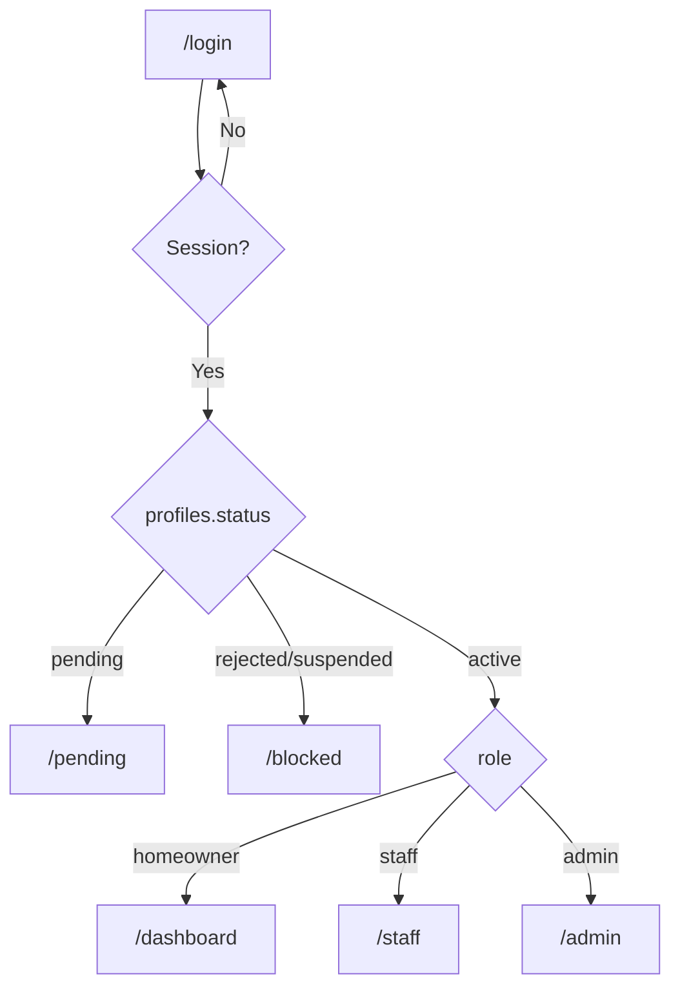
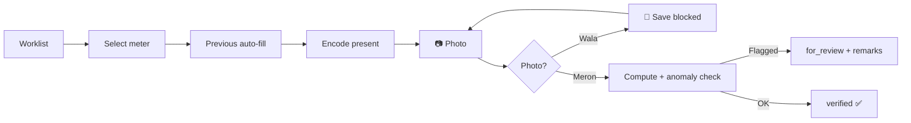
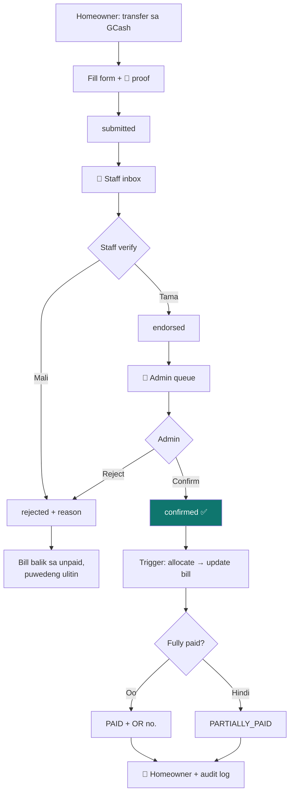
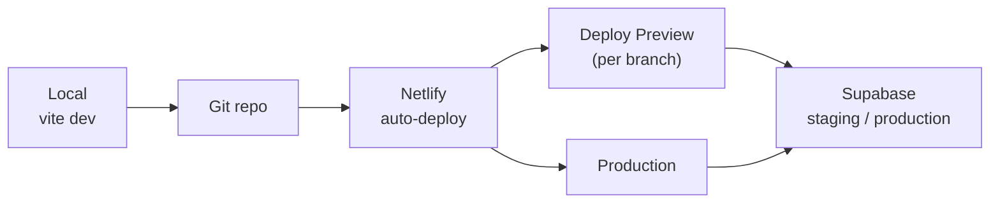

# Implementation Phases — SCS Billing Portal
## Santa Cicilia Subdivision · Water & Electricity Billing

> Kasamang dokumento ng [PRD.md](./PRD.md). Ang PRD = **ano** at **bakit**. Ang dokumentong ito = **paano** at **kailan**.

| Field | Value |
|---|---|
| Version | v1.0 · 2026-07-20 |
| Stack | **React 19 + Vite + TypeScript + Tailwind CSS v4** |
| Hosting | **Netlify** (SPA + redirects) |
| Backend | **Supabase** — Postgres, Auth, Storage, Realtime, RLS |
| UI direction | High-code, hand-built components. Professional / utility-corporate look — hindi "startup toy". |
| Rule | **Payment feature ang huli.** Lahat ng iba ay dapat matibay bago hawakan ang pera. |

> **Stack change note:** Ang PRD §6 ay nakasulat na Next.js. Ang aktwal na pinili ay **React + Vite + Netlify** (SPA). Ito ang masusunod. Epekto: walang server-side rendering, kaya lahat ng seguridad ay nasa **Supabase RLS** — na siya namang tamang lugar nito.

---

## 0. Phase Overview / Buod ng mga Yugto

```mermaid
flowchart LR
    P0["Phase 0<br/>Foundation<br/>+ Design System"] --> P1["Phase 1<br/>Auth & Roles"]
    P1 --> P2["Phase 2<br/>Master Data<br/>Properties • Meters • Users"]
    P2 --> P3["Phase 3<br/>Meter Reading<br/>📷 photo evidence"]
    P3 --> P4["Phase 4<br/>Billing Engine<br/>Rates • Cycles • Bills"]
    P4 --> P5["Phase 5<br/>Homeowner Portal<br/>Bills • Consumption"]
    P5 --> P6["Phase 6<br/>Messaging<br/>Concerns • Notifications"]
    P6 --> P7["💰 Phase 7<br/>PAYMENT<br/>Submit → Endorse → Confirm"]
    P7 --> P8["Phase 8<br/>Reports • Audit<br/>Polish • Launch"]

    style P7 fill:#0f766e,color:#fff,stroke:#0f766e
    style P0 fill:#1e293b,color:#fff,stroke:#1e293b
```



| # | Phase | Focus | Est. | Status |
|---|---|---|---|---|
| 0 | Foundation & Design System | Vite, Tailwind, routing, UI kit, Netlify | 3–4 days | 🟡 In progress |
| 1 | Auth & Role Routing | Supabase Auth, register, pending gate, guards | 4–5 days | ⚪ Not started |
| 2 | Master Data | Properties, meters, homeowner & staff mgmt | 5–6 days | ⚪ |
| 3 | Meter Reading | Staff worklist, encode + required photo | 6–7 days | ⚪ |
| 4 | Billing Engine | Rates, cycles, generate + release bills | 7–8 days | ⚪ |
| 5 | Homeowner Portal | Bills, detail, consumption charts, SOA | 5–6 days | ⚪ |
| 6 | Messaging & Notifications | Concern threads, realtime, announcements | 5–6 days | ⚪ |
| 7 | **Payment** 💰 | Submit → Endorse → Confirm → ledger | 8–10 days | ⚪ |
| 8 | Reports, Audit & Launch | Reports, PDF, audit log, UAT, pilot | 7–10 days | ⚪ |

**Total: ~10–12 weeks** (1 developer, part-time-friendly)

---

## Phase 0 — Foundation & Design System
**Layunin:** Matibay na pundasyon at magandang UI kit bago pa may feature. Dito nakasalalay ang "professional looking".

### Deliverables
- [ ] Vite + React 19 + TypeScript project
- [ ] Tailwind CSS v4 (`@tailwindcss/vite`) + design tokens
- [ ] Design system: color, typography, spacing, elevation, radius scale
- [ ] Base components: `Button` `Input` `Select` `Card` `Badge` `Table` `Modal` `Toast` `Tabs` `Skeleton` `EmptyState` `Alert` `Avatar` `Dropdown` `Pagination` `FileUpload` `StatTile`
- [ ] App shell: sidebar + topbar + breadcrumb, responsive (drawer sa mobile)
- [ ] React Router v7 with layout routes
- [ ] i18n scaffold (EN/TL) — `useT()` hook + `locales/en.json`, `locales/tl.json`
- [ ] Supabase client + typed DB helper
- [ ] TanStack Query provider + Zustand store
- [ ] `.env.example`, `netlify.toml`, SPA redirect
- [ ] Landing page (public) — hero, how it works, announcements, contact, FAQ
- [ ] Deployed to Netlify (staging URL live)

### Design language / Direksyon ng disenyo
```
Brand           Deep teal #0F766E  (tubig)  +  Amber #B45309  (kuryente)
Neutrals        Slate 50→950, hairline borders, walang heavy shadows
Typography      Inter / Instrument Sans · tabular-nums sa lahat ng pera at metro
Density         Compact-comfortable — data table ang bida, hindi ang whitespace
Elevation       Border-first, shadow-sm lang; walang glassmorphism
Radius          8px cards · 6px inputs · 999px badges
Money           ₱ prefix, right-aligned, 2 decimals, tabular
Motion          150–200ms ease-out lang; walang bouncing
Dark mode       Supported (v1 optional, tokens handa na)
Look & feel     Parang banking dashboard / utility ERP — malinis, mapagkakatiwalaan
```

### Folder structure
```
src/
  app/            router, providers, App.tsx
  components/ui/  design system primitives
  components/     shared composites (AppShell, DataTable, PageHeader…)
  features/
    auth/  properties/  meters/  readings/
    billing/  homeowner/  messaging/  payments/  admin/
  lib/            supabase.ts, format.ts, cn.ts, constants.ts
  hooks/          useAuth, useRole, useT, useToast
  locales/        en.json, tl.json
  types/          database.types.ts (generated), domain.ts
  pages/          route components
```

### Exit criteria
- Netlify staging URL bukas at gumagana ang landing page
- Deep-link (`/login`) hindi 404 (SPA redirect OK)
- Lahat ng base component may demo sa `/kitchen-sink` (dev-only route)
- Lighthouse mobile ≥ 90 sa performance at accessibility

---

## Phase 1 — Auth & Role Routing
**Layunin:** Makapasok ang 3 role at hindi makalusot ang hindi dapat.

### Deliverables
- [ ] Supabase project + **email confirmation OFF**
- [ ] `profiles` table + `on_auth_user_created` trigger (role=`homeowner`, status=`pending`)
- [ ] Register page (email, password, full name, contact, Block & Lot, consent checkbox)
- [ ] Login page + forgot/reset password
- [ ] `/pending` screen — "Hintayin ang approval ng admin"
- [ ] `/blocked` screen para sa `rejected` / `suspended`
- [ ] `AuthProvider` + `useAuth()` + session persistence
- [ ] `<RoleGuard allow={['admin']}>` route guards
- [ ] Role-based redirect after login (homeowner → `/dashboard`, staff → `/staff`, admin → `/admin`)
- [ ] Admin: pending registrations list → Approve (link to property) / Reject
- [ ] RLS policies on `profiles`



### Exit criteria
- 3 test accounts (admin/staff/homeowner) nakakapasok sa tamang portal
- Homeowner na direktang pumunta sa `/admin` → redirected, hindi flash ng admin UI
- **RLS test:** raw API call gamit ang staff JWT para baguhin ang ibang `profiles` row → **403**
- Bagong rehistro ay `pending` at hindi makakita ng anumang billing data

---

## Phase 2 — Master Data
**Layunin:** Alam ng sistema kung sino ang nakatira saan at anong metro ang gamit.

### Deliverables
- [ ] Tables: `properties`, `property_owners`, `meters` + RLS
- [ ] Admin › Properties: CRUD, block/lot/phase, occupied/vacant, search + filter
- [ ] Admin › Meters: per property, water + electric, meter number, initial reading, digits
- [ ] Meter replacement flow (old → `replaced`, bagong reading base)
- [ ] Admin › Homeowners: list, detail, approve, link/unlink property, activate/deactivate, reset password
- [ ] Admin › Staff: create staff account, assign zone/block, deactivate
- [ ] Bulk import from CSV (properties + meters) — para sa existing na records
- [ ] Reusable `DataTable` (sort, filter, paginate, export CSV)

### Exit criteria
- 100% ng test households nakalagay na may 2 metro bawat isa
- Staff role: nakikita ang property/meter list, **walang** edit action, at walang access sa `profiles` ng iba
- CSV import ng 100 rows gumagana at may error report

---

## Phase 3 — Meter Reading (📷 photo required)
**Layunin:** Walang reading na walang patunay.

### Deliverables
- [ ] Tables: `billing_cycles`, `meter_readings` + RLS + compute trigger
- [ ] Storage bucket `meter-photos` (private) + policies
- [ ] Admin › Cycles: create/open cycle (code, reading window, bill date, due date, grace)
- [ ] Staff › Worklist: grouped by block, progress bar, filter (unread/read/flagged), search
- [ ] Staff › Encode Reading form:
  - previous reading auto-filled, read-only
  - present reading (numeric keypad sa mobile)
  - **camera capture / upload — Save disabled hangga't walang litrato**
  - client-side image compression (≤ 1MB)
  - live consumption preview
  - remarks field
- [ ] Anomaly detection: negative · zero · >200% ng 3-month average → `for_review` + required remarks
- [ ] Offline draft (localStorage) + sync indicator
- [ ] Reading review queue para sa admin (flagged only)
- [ ] Photo viewer w/ zoom + upload metadata (kailan, sino)



### Exit criteria
- Imposibleng mag-save ng reading na walang litrato (UI **at** DB `NOT NULL`)
- 20 readings na-encode sa cellphone sa loob ng 15 minuto
- Nawalan ng signal → hindi nawala ang draft, nag-sync pagbalik
- Anomaly na reading hindi tuloy-tuloy sa billing hangga't hindi na-review

---

## Phase 4 — Billing Engine
**Layunin:** Tama at hindi mauulit ang singil.

### Deliverables
- [ ] Tables: `rates`, `bills`, `bill_items` + RLS + sequences
- [ ] Admin › Rates: water per m³, electric per kWh, minimum charge, association dues, penalty %/fixed, grace days — **effective-dated**, may history
- [ ] Tiered rate support (jsonb tiers)
- [ ] Bill generation engine:
  - kunin lahat ng `verified` readings sa cycle
  - apply active rate as of bill date
  - + previous balance, + assoc dues
  - `UNIQUE (property_id, billing_cycle_id)` → walang doble
- [ ] Draft bill review screen (totals, count, exception list)
- [ ] **Release** action → status `unpaid`, notify homeowners
- [ ] Admin adjustments: credit/debit memo, void bill w/ reason
- [ ] `pg_cron` penalty job: overdue after due + grace
- [ ] Bill print/PDF template

### Exit criteria
- Isang buong cycle na-generate mula sa reading, tugma sa manual computation sa Excel (100 households)
- Pagpapatakbo ulit ng generation → walang duplicate, malinaw ang skip reason
- Pagtaas ng rate ngayon ay **hindi** nagbago ng lumang bill
- Penalty tumama sa tamang araw

---

## Phase 5 — Homeowner Portal
**Layunin:** Malinaw sa may-ari kung magkano, bakit, at kailan.

### Deliverables
- [ ] Dashboard: balance card, next due countdown, latest water + electric reading, mini consumption chart, latest announcement
- [ ] My Bills: list + status badge, filter by year/utility, search
- [ ] Bill Detail: previous/present/consumption/rate/amount breakdown, penalty, total, **meter photo viewer**
- [ ] Consumption page: 12-month bar chart (water m³ + electric kWh), peso overlay, MoM comparison, "mas mataas ka ng X% kumpara noong nakaraang buwan"
- [ ] SOA download (PDF)
- [ ] Profile page (contact, password, language)
- [ ] Announcements feed
- [ ] Full EN/TL translation ng lahat ng homeowner screen
- [ ] PWA manifest + installable

### Exit criteria
- Homeowner nakikita **lang** ang sarili niyang data (RLS-tested via raw API)
- Bill detail nagpapakita ng litrato ng metro na basis ng singil
- Nabasa at naintindihan ng 5 test resident nang walang tulong (usability check)

---

## Phase 6 — Messaging, Notifications & Announcements
**Layunin:** Isang lugar lang ang usapan — hindi na sa Messenger.

### Deliverables
- [ ] Tables: `message_threads`, `messages`, `notifications`, `announcements` + RLS
- [ ] Storage bucket `message-attachments`
- [ ] Homeowner: new concern (category: Billing · Meter · Requirements · Complaint · Others), threaded replies, attachments
- [ ] Staff: concerns inbox — assigned/unassigned, reply, internal note, resolve, **escalate to admin**
- [ ] Admin: all threads + escalated queue
- [ ] Supabase Realtime: bagong mensahe = instant badge
- [ ] Notification center (bell) + unread count + mark all read
- [ ] Email notification (Resend) sa key events
- [ ] Admin › Announcements: post to all / per block, public toggle, schedule
- [ ] Auto-close resolved threads after 7 days (cron)

### Exit criteria
- End-to-end thread: homeowner → staff reply → escalate → admin resolve
- Realtime badge lumalabas nang walang refresh
- Attachment (litrato ng requirement) na-upload at nabuksan ng staff

---

## Phase 7 — 💰 PAYMENT (ang huli at pinaka-delikado)
**Layunin:** Walang perang nawawala at may pananagutan sa bawat piso.
**Bakit huli:** Kailangan tapos at matibay muna ang bill, balance, at role separation bago ikabit ang pera.

### Deliverables
- [ ] Tables: `payments`, `payment_allocations` + RLS + `trg_payment_confirmed`
- [ ] Storage bucket `payment-proofs` (private, signed URLs)
- [ ] Admin › Payment Settings: GCash/Maya number, bank account, **QR upload**, instructions (EN/TL)
- [ ] **Homeowner › Pay Now:**
  - channel picker + QR + copy-to-clipboard account number
  - form: amount, method, reference no., payment date
  - **proof upload — REQUIRED**, compressed, preview
  - duplicate reference-number check
  - submit → `submitted`, bill → `payment_pending`
- [ ] **Staff › Endorsement Inbox:**
  - queue oldest-first, SLA indicator
  - split view: proof (zoomable) vs bill details
  - **Endorse** (records staff id + timestamp + remarks) / **Reject** (reason required)
  - staff **cannot** set `confirmed` — blocked by RLS + trigger
- [ ] **Admin › Confirmation Queue:**
  - endorsed payments only
  - proof + bill + homeowner history side-by-side
  - **Confirm** → trigger posts allocation, updates `amount_paid`, sets `paid` / `partially_paid`, generates OR number
  - **Reject** → reason back to homeowner
  - Void confirmed payment (admin only, reason + audit)
- [ ] Partial payment + running balance
- [ ] Admin-encoded walk-in / cash payment
- [ ] Official receipt PDF
- [ ] Realtime notifications sa bawat status change
- [ ] Payment history + status timeline para sa homeowner



### Exit criteria — **strictest phase**
- End-to-end sa staging: submit → endorse → confirm → bill `paid` + OR generated
- Staff JWT na sumubok mag-set ng `confirmed` via raw API → **403**
- Partial payment: ₱500 sa ₱1,200 bill → `partially_paid`, balance ₱700, susunod na ₱700 → `paid`
- Rejected payment → bill bumalik sa dating status, kayang mag-resubmit
- Bawat confirm/reject/void may audit log entry na may actor at timestamp
- Ledger reconciliation: kabuuang confirmed payments = kabuuang bawas sa balance (₱0 discrepancy sa 50 test payments)
- Proof file hindi ma-access nang walang signed URL

---

## Phase 8 — Reports, Audit & Launch
**Layunin:** Kayang patakbuhin ng HOA nang walang developer.

### Deliverables
- [ ] Admin dashboard: billed / collected / outstanding / collection rate %, trend chart
- [ ] Reports: collection, aging (30/60/90), consumption, staff performance, payment log
- [ ] Export CSV + PDF sa lahat ng report
- [ ] `audit_logs` table + trigger sa lahat ng financial table + admin viewer (filterable)
- [ ] Full i18n sweep (walang natirang hardcoded string)
- [ ] Accessibility pass (WCAG 2.1 AA, ≥16px base)
- [ ] Error boundary + Sentry + empty/loading/error states sa lahat ng screen
- [ ] Rate limiting + captcha sa register
- [ ] Backup + restore runbook
- [ ] Admin & staff user manual (EN/TL) + training session
- [ ] **Pilot: 20 households × 1 full cycle** (parallel run kasama ang manual)
- [ ] Go-live: custom domain, production Supabase, monitoring

### Exit criteria
- Collection report tugma sa manual na tala ng treasurer (₱0 variance)
- Nakapagpatakbo ang HOA ng isang buong cycle nang walang tulong ng developer
- Zero critical bug sa 2 linggong pilot

---

## Cross-Cutting Rules / Panuntunan sa Bawat Phase

| Rule | Detalye |
|---|---|
| **RLS-first** | Bawat bagong table = policy agad. Hindi puwedeng "mamaya na". Ang UI ay convenience lang; ang DB ang seguridad. |
| **Security test kada phase** | Sa bawat exit, subukan ang raw API gamit ang maling role. Dapat 403. |
| **Walang service-role key sa client** | `VITE_SUPABASE_ANON_KEY` lang. Ang service key ay Edge Function lang. |
| **Bilingual habang ginagawa** | Bawat bagong string ay pumapasok agad sa `en.json` at `tl.json`. Huwag ipagpaliban. |
| **Mobile-first** | Test sa 360px width bago sa desktop. Karamihan ay cellphone gagamit. |
| **Walang hard delete** | Financial data = soft delete + audit log. |
| **Money = integer centavos sa logic** | Iwas floating-point error. Format lang sa display. |
| **Seed data** | Panatilihin ang `supabase/seed.sql` na may 3 role + 10 property + 2 cycle para mabilis mag-test. |

---

## Deployment Setup



**`netlify.toml`**
```toml
[build]
  command = "npm run build"
  publish = "dist"

[[redirects]]
  from = "/*"
  to = "/index.html"
  status = 200
```

**Environment variables (Netlify UI + `.env.local`)**
```
VITE_SUPABASE_URL=
VITE_SUPABASE_ANON_KEY=
VITE_APP_NAME="Santa Cicilia Subdivision"
```

| Environment | Branch | Supabase project |
|---|---|---|
| Production | `main` | `scs-billing-prod` |
| Staging | `develop` | `scs-billing-staging` |
| Preview | any PR | staging |

---

## Definition of Done (bawat feature)
1. ✅ Gumagana sa mobile (360px) at desktop
2. ✅ May loading, empty, at error state
3. ✅ May EN at TL na string
4. ✅ RLS policy nakasulat at na-test gamit ang maling role
5. ✅ Naka-deploy sa staging at na-verify
6. ✅ Walang TypeScript error, walang console error
7. ✅ Financial action ay naka-audit log

---

*End of PHASES — SCS Billing Portal*
