# Product Requirements Document (PRD)
## Santa Cicilia Subdivision — Utility Billing & Payment System
### "SCS Billing Portal"

| Field | Value |
|---|---|
| Document version | v1.0 |
| Date | 2026-07-20 |
| Owner | LR Properties / Santa Cicilia Subdivision Admin |
| Status | Draft for approval |
| Stack | Next.js (App Router) + Supabase (Postgres, Auth, Storage, Realtime, RLS) |
| Language | Bilingual — English + Tagalog (EN/TL toggle) |

> **Note sa spelling:** Kung ang opisyal na pangalan ay *"Santa Cecilia"*, sabihin lang at papalitan sa buong dokumento at sa branding.

---

## 1. Overview / Pangkalahatang Ideya

**EN —** SCS Billing Portal is a web-based utility billing system for Santa Cicilia Subdivision. It digitizes the monthly meter reading, billing, payment, and confirmation cycle for **water** and **electricity**. Homeowners view their bills and consumption online, submit concerns and requirements, and pay via online transfer (GCash, Maya, bank transfer) by uploading proof of payment. Staff perform meter readings with **mandatory photo evidence**, generate bills, and endorse payments. Admin has full oversight and gives the **final payment confirmation**.

**TL —** Ang SCS Billing Portal ay isang web-based na sistema ng billing para sa Santa Cicilia Subdivision. Dinidigitize nito ang buwanang pagbabasa ng metro, billing, bayad, at kumpirmasyon para sa **tubig** at **kuryente**. Nakikita ng homeowner ang kanilang bill at konsumo online, nakakapagpadala ng concern at requirements, at nakakabayad sa pamamagitan ng online transfer (GCash, Maya, bank transfer) na may na-upload na resibo. Ang staff ang nagbabasa ng metro na **kailangang may larawan bilang ebidensya**, gumagawa ng bill, at nag-eendorso ng bayad. Ang admin ang may buong kontrol at siya ang **huling nagkukumpirma ng bayad**.

### 1.1 Problem Statement / Suliranin
| # | Problem (EN) | Suliranin (TL) |
|---|---|---|
| P1 | Manual, paper-based meter reading is error-prone and disputable | Manu-manong pagbabasa ng metro — madaling magkamali at pinagtatalunan |
| P2 | No proof that the reading was actually taken | Walang patunay na talagang nabasa ang metro |
| P3 | Homeowners don't know their balance, due date, or consumption history | Hindi alam ng homeowner ang balanse, due date, at history ng konsumo |
| P4 | Payments via GCash/transfer are untracked; receipts get lost in chat | Ang bayad sa GCash/transfer ay hindi natrack; nawawala ang resibo sa chat |
| P5 | Concerns are scattered across text messages and Facebook | Magulo ang mga concern — nasa text at Facebook |
| P6 | No audit trail — sino ang nag-approve, kailan, magkano | Walang audit trail — walang record kung sino at kailan nag-approve |

### 1.2 Goals & Success Metrics / Layunin at Sukatan
| Goal | Metric | Target (6 months) |
|---|---|---|
| Digitize meter reading | % readings with photo evidence | 100% |
| Faster billing cycle | Days from reading → bill released | ≤ 2 days |
| Payment visibility | % payments with uploaded proof | ≥ 95% |
| Faster confirmation | Hours from payment submit → admin confirm | ≤ 24 hrs |
| Adoption | Active homeowner accounts | ≥ 80% of households |
| Dispute reduction | Billing disputes per month | −70% |
| Concern response | First staff reply time | ≤ 24 hrs |

### 1.3 Out of Scope (Phase 1) / Hindi Kasama sa Unang Bahagi
- Automatic payment gateway integration (PayMongo/Xendit) — **manual transfer + proof upload muna**
- Native mobile app (PWA-only ang Phase 1)
- Accounting software integration (QuickBooks/Xero)
- IoT / smart meters
- SMS blasting (email + in-app notification muna)

---

## 2. Users & Roles / Mga Gumagamit at Papel

Tatlo lang (3) ang role: **Admin**, **Staff**, **Homeowner**.

### 2.1 Role Matrix / Talaan ng Pahintulot

| Capability | Homeowner | Staff | Admin |
|---|:---:|:---:|:---:|
| View own bills & consumption | ✅ | ❌ | ✅ |
| View any homeowner's bills | ❌ | ✅ (billing data only) | ✅ |
| View/edit homeowner **account** (profile, email, password, status) | ✅ own only | ❌ **bawal** | ✅ |
| Create/edit staff accounts | ❌ | ❌ | ✅ |
| Encode meter reading | ❌ | ✅ | ✅ |
| Upload meter photo evidence | ❌ | ✅ **required** | ✅ |
| Generate / release bill | ❌ | ✅ | ✅ |
| Void / adjust a bill | ❌ | ❌ (request only) | ✅ |
| Submit payment + proof | ✅ | ❌ | ✅ (on behalf, walk-in) |
| **Endorse** payment (1st check) | ❌ | ✅ | ✅ |
| **Confirm** payment (final) | ❌ | ❌ | ✅ |
| Reject payment | ❌ | ✅ (endorse-reject) | ✅ |
| Messaging / concerns | ✅ send | ✅ reply | ✅ reply |
| Set rates, penalties, due dates | ❌ | ❌ | ✅ |
| Reports & exports | own SOA | assigned scope | ✅ full |
| Audit log | ❌ | ❌ | ✅ |
| Announcements | ✅ read | ✅ read | ✅ post |

### 2.2 Personas
**Aling Nena — Homeowner (Blk 5 Lot 12)**
Gusto niyang makita kung magkano ang bayarin, kailan ang due, at ilan ang cubic meter niya ngayong buwan kumpara noong nakaraan. Nagbabayad siya sa GCash at nag-uupload ng screenshot.

**Kuya Mark — Staff (Meter Reader / Billing Clerk)**
Umiikot sa subdivision, kinukunan ng litrato ang bawat metro, ini-encode ang reading sa phone. Sinasagot ang concern ng homeowner. **Hindi niya kayang buksan o baguhin ang account ng homeowner** — billing at concern lang.

**Ma'am Grace — Admin (HOA Treasurer)**
Tinitignan ang lahat ng account, ini-set ang rate kada cubic meter at kada kWh, at siya ang **final approver** ng bawat payment. Naglalabas ng monthly collection report.

---

## 3. Feature Requirements / Mga Tampok

### 3.1 Landing Page (Public)
- Hero: pangalan ng subdivision, logo, tagline (EN/TL toggle)
- Sections: About, How it works (3 steps), Announcements (public), Contact, FAQ
- CTA: **Login** at **Register**
- Footer: office hours, contact number, payment channels (GCash / Maya / BDO)
- Responsive, mobile-first (karamihan ay cellphone gagamit)

### 3.2 Authentication (Supabase Auth)
- Email + password sign-up
- **Email confirmation is DISABLED** (`Confirm email = OFF` sa Supabase Auth settings) — per user requirement
- Instead: bagong sign-up = status `pending` → **admin must approve/link** the account to a lot before full access
- Forgot password (magic reset link)
- Session via Supabase SSR cookies; middleware-based route protection
- Optional Phase 2: Google OAuth

> **Bakit may `pending`?** Dahil naka-off ang email confirmation, kailangan may gate para hindi basta-basta makapasok ang random na nag-register. Ang admin ang magsasabi na "oo, taga-Blk 5 Lot 12 nga siya."

### 3.3 Homeowner Portal
| Feature | Description (EN) | Paliwanag (TL) |
|---|---|---|
| Dashboard | Current balance, next due date, latest water + electric reading, consumption sparkline | Balanse, susunod na due, pinakabagong reading, graph ng konsumo |
| My Bills | List of bills w/ status (Unpaid / Partially Paid / Paid / Overdue), filter by year & utility | Listahan ng bill at status |
| Bill Detail | Previous reading, present reading, consumption (m³ / kWh), rate, amount, penalty, total, **meter photo** viewer | Detalye ng bill kasama ang litrato ng metro |
| Consumption History | 12-month bar chart, water vs electric, m³ / kWh + peso | Kasaysayan ng konsumo |
| Pay Now | Shows payment channels + QR, upload proof (image/PDF), enter ref no., amount, date | Paano magbayad + upload ng resibo |
| Payment History | Status: Submitted → Endorsed → Confirmed / Rejected | Kasaysayan ng bayad at status |
| Message Box | Threaded conversation with staff/admin; categories: Billing Concern, Meter Issue, Requirements/Documents, Complaint, Others; file attachment | Kahon ng mensahe para sa concern at requirements |
| Statement of Account | Download PDF SOA | I-download ang SOA |
| Announcements | HOA notices (water interruption, deadlines) | Mga abiso ng HOA |
| Profile | Name, contact, address (lot is read-only), change password | Profile at password |

### 3.4 Staff Portal
| Feature | Description | Paliwanag |
|---|---|---|
| Reading Worklist | Households due for reading this cycle, grouped by block/phase; progress bar (e.g. 42/120 read) | Listahan ng babasahin ngayong cycle |
| Encode Reading | Select property → previous reading auto-filled → enter present reading → **upload meter photo (REQUIRED)** → auto-compute consumption | Pag-encode ng reading, **required ang litrato** |
| Anomaly Warning | Flags reading if 0, lower than previous, or >200% of 3-month average | Babala kung kakaiba ang reading |
| Generate Bill | Batch or per-household; applies active rate + due date + penalty rule; status → `draft` | Paggawa ng bill |
| Release Bill | Publish draft bills → homeowner notified | Paglabas ng bill |
| Homeowner Billing View | Read-only list of homeowner billing info: next billing date, meter numbers, readings, balance. **No access to account credentials or profile editing** | Nakikita ang billing info lang — **bawal ang account** |
| Payment Endorsement | Inbox of submitted payments → verify proof vs amount/ref → **Endorse to Admin** or **Reject with reason** | Pag-endorso ng bayad sa admin |
| Concerns Inbox | Assigned/unassigned tickets, reply, attach, mark resolved, escalate to admin | Inbox ng concern |
| Field Mode | Mobile-optimized, offline draft (localStorage) then sync | Para sa field, gamit ang cellphone |

### 3.5 Admin Portal
| Feature | Description | Paliwanag |
|---|---|---|
| Dashboard | Total billed, collected, outstanding, collection rate %, pending confirmations, open concerns | Buod ng lahat |
| Payment Confirmation Queue | **Core feature.** Endorsed payments → view proof side-by-side with bill → **Confirm** (posts payment, updates balance) or **Reject** (reason back to homeowner) | Ang pangunahing gawain ng admin |
| Homeowner Management | Full CRUD, approve `pending` registrations, link user ↔ property, activate/deactivate, reset password | Buong kontrol sa account ng homeowner |
| Staff Management | Create/deactivate staff, assign blocks/zones, view staff activity | Kontrol sa staff |
| Property & Meter Registry | Blocks, lots, meter numbers (water & electric), meter replacement history | Talaan ng lote at metro |
| Rate Settings | Water rate per m³ (flat or tiered), electric rate per kWh, minimum charge, association dues, penalty %/fixed, grace period, reading & due schedule — **effective-dated** | Setting ng singil, penalty, at iskedyul |
| Billing Cycle Control | Open/close cycle, bulk generate, bulk release, apply penalties to overdue | Kontrol sa billing cycle |
| Adjustments | Credit/debit memo, bill void with reason | Pag-aayos ng bill |
| Reports | Collection report, aging/receivables, consumption report, staff performance, exports (CSV/PDF) | Mga ulat |
| Announcements | Post to all / per block; public or portal-only | Pag-post ng abiso |
| Audit Log | Immutable who-did-what-when | Talaan ng lahat ng galaw |

### 3.6 Added Features (my recommendations) / Mga Idinagdag Kong Feature
Ito ang mga dinagdag ko dahil kailangan talaga ng ganitong sistema:

1. **Penalty & grace period engine** — auto-apply surcharge after due date.
2. **Anomaly detection sa reading** — pinipigilan ang maling encode bago pa maging bill.
3. **Effective-dated rates** — kapag tumaas ang singil, hindi maaapektuhan ang lumang bill.
4. **Announcements module** — tapos na ang Facebook group para sa abiso.
5. **Audit log** — kritikal sa pera; sino ang nag-confirm ng bayad.
6. **Partial payments & running balance** — may nagbabayad ng hulugan.
7. **SOA PDF export** — kailangan sa loan, clearance, at reklamo.
8. **Meter replacement history** — kapag pinalitan ang metro, nag-reset ang reading; kailangan ma-handle.
9. **Realtime notifications** (Supabase Realtime) — instant na alam ng staff na may bagong bayad.
10. **Bilingual EN/TL toggle** — para sa mga senior at hindi sanay sa English.
11. **Soft delete everywhere** — walang tunay na burahan sa financial data.
12. **Idempotent billing** — hindi puwedeng ma-doble ang bill sa isang cycle (unique constraint).
13. **Reading proof watermark/EXIF check** — timestamp at GPS (kung available) para hindi lumang litrato.
14. **Association dues line item** — opsyonal, kasama sa parehong bill.
15. **Overdue reminder job** — 3 days before due at 1 day after due.

---

## 4. Flowcharts / Mga Flowchart

### 4.1 System Context / Konteksto ng Sistema
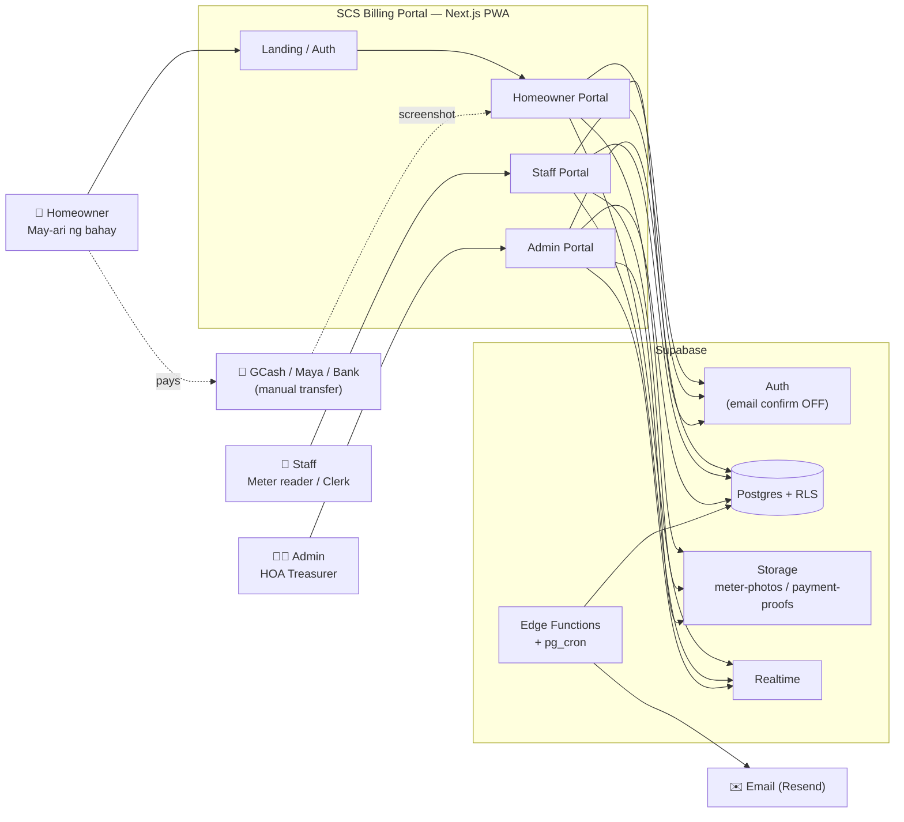

### 4.2 Registration & Approval / Rehistro at Pag-apruba
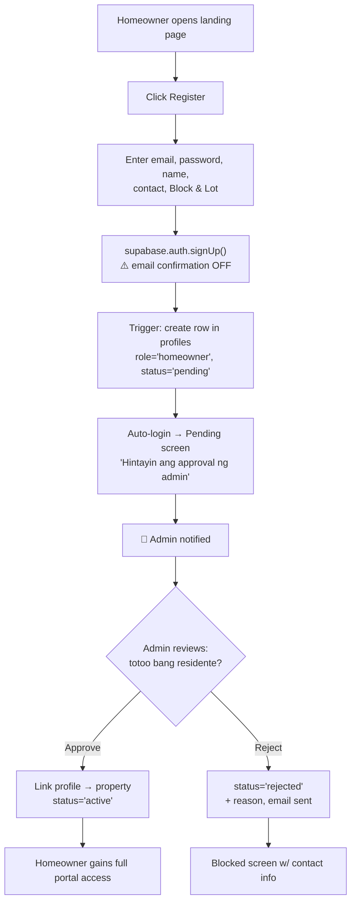

### 4.3 Meter Reading → Billing / Pagbasa ng Metro hanggang Bill
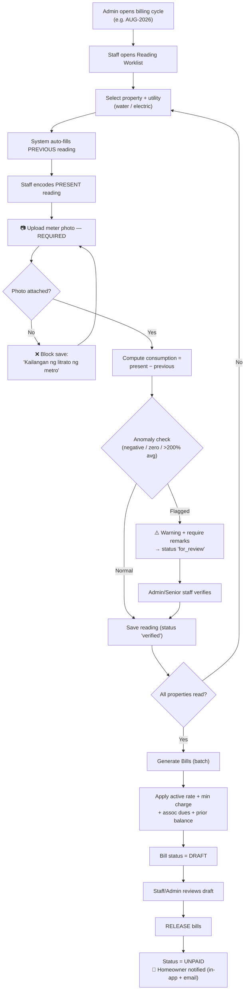

### 4.4 Payment Flow — Homeowner → Staff → Admin ⭐
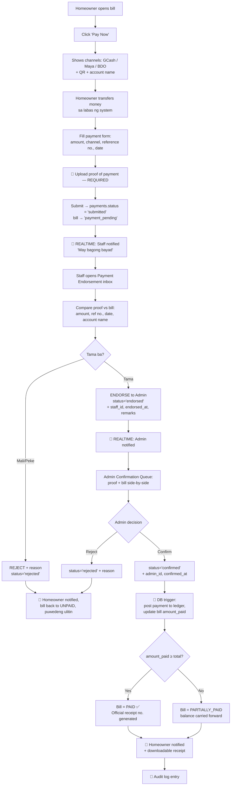

### 4.5 Payment Status State Machine / Estado ng Bayad
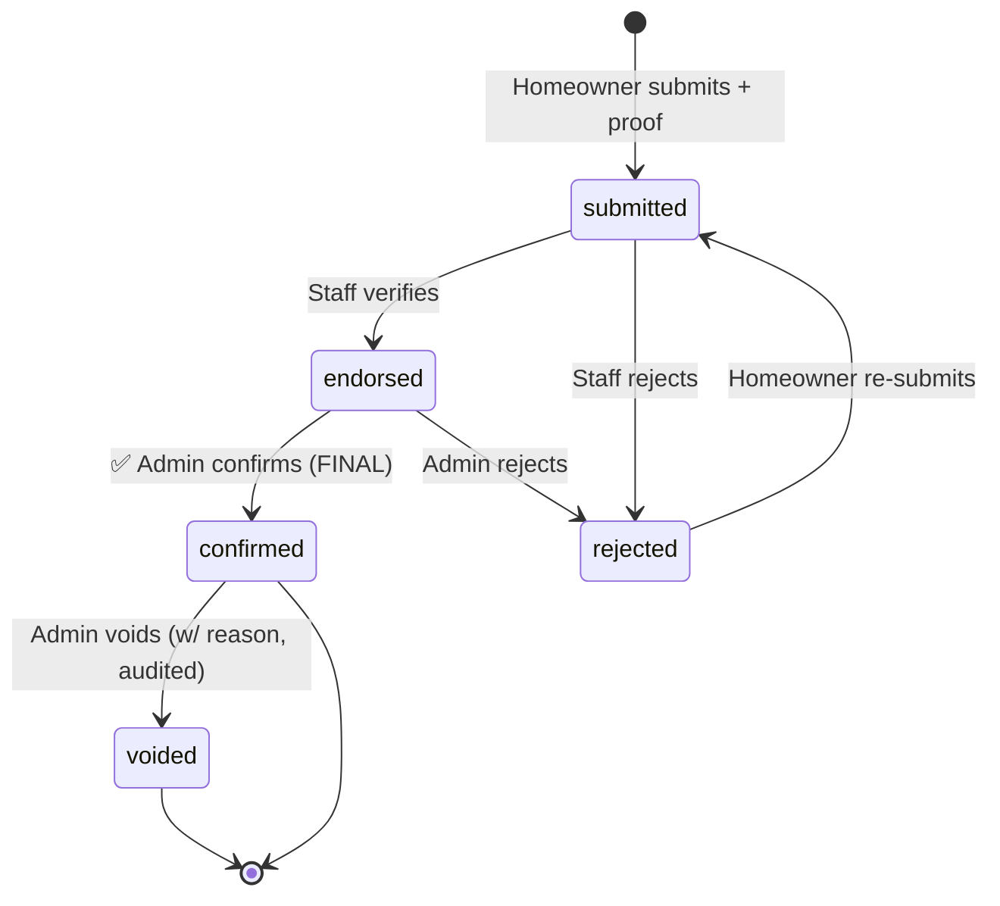

### 4.6 Bill Lifecycle / Buhay ng Bill
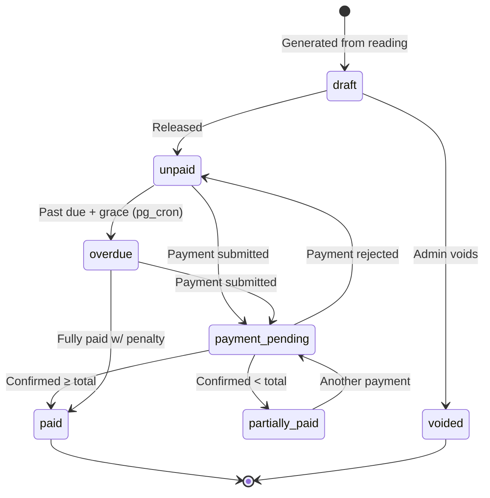

### 4.7 Message / Concern Flow / Daloy ng Concern
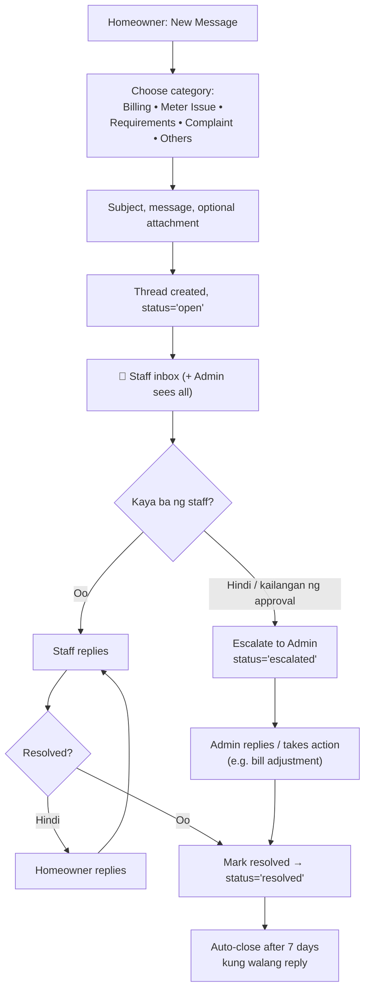

### 4.8 Role-Based Access / Daloy ng Access
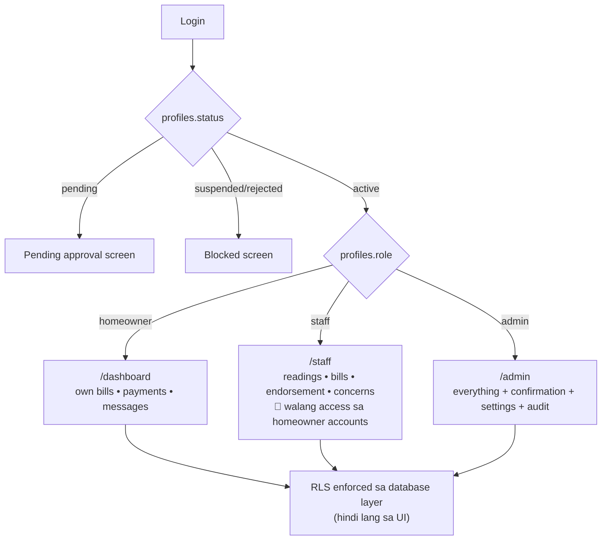

### 4.9 Monthly Cycle Timeline / Buwanang Siklo
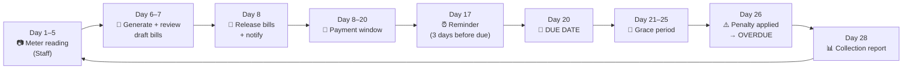

---

## 5. Database Design (Supabase / Postgres)

### 5.1 ERD
```mermaid
erDiagram
    profiles ||--o{ property_owners : "owns"
    properties ||--o{ property_owners : "owned by"
    properties ||--o{ meters : has
    meters ||--o{ meter_readings : "has readings"
    billing_cycles ||--o{ bills : contains
    properties ||--o{ bills : "billed to"
    bills ||--o{ bill_items : "line items"
    meter_readings ||--o| bill_items : "sourced from"
    bills ||--o{ payment_allocations : "paid by"
    payments ||--o{ payment_allocations : allocates
    profiles ||--o{ payments : submits
    profiles ||--o{ message_threads : opens
    message_threads ||--o{ messages : contains
    rates ||--o{ bill_items : "priced by"
    profiles ||--o{ audit_logs : performs
    profiles ||--o{ notifications : receives
    properties ||--o{ announcements : "targeted (optional)"

    profiles {
        uuid id PK "= auth.users.id"
        text role "admin|staff|homeowner"
        text status "pending|active|suspended|rejected"
        text full_name
        text contact_number
        text email
        text preferred_language "en|tl"
        uuid approved_by FK
        timestamptz approved_at
        timestamptz created_at
    }
    properties {
        uuid id PK
        text block
        text lot
        text phase
        text address_line
        text status "occupied|vacant|inactive"
        text assigned_zone
    }
    property_owners {
        uuid id PK
        uuid property_id FK
        uuid profile_id FK
        bool is_primary
        date start_date
        date end_date
    }
    meters {
        uuid id PK
        uuid property_id FK
        text utility_type "water|electric"
        text meter_number UK
        numeric initial_reading
        int digits
        text status "active|replaced|inactive"
        uuid replaced_meter_id FK
        date installed_at
    }
    meter_readings {
        uuid id PK
        uuid meter_id FK
        uuid billing_cycle_id FK
        numeric previous_reading
        numeric present_reading
        numeric consumption "generated"
        text photo_path "REQUIRED"
        text photo_taken_at
        uuid read_by FK "staff"
        timestamptz read_at
        text status "draft|for_review|verified|rejected"
        text remarks
        bool is_anomaly
    }
    billing_cycles {
        uuid id PK
        text code UK "e.g. 2026-08"
        date reading_start
        date reading_end
        date bill_date
        date due_date
        int grace_days
        text status "open|reading|billed|closed"
    }
    rates {
        uuid id PK
        text utility_type "water|electric|assoc_dues"
        text rate_type "flat|tiered|fixed"
        numeric rate_per_unit
        numeric minimum_charge
        jsonb tiers
        numeric penalty_percent
        numeric penalty_fixed
        date effective_from
        date effective_to
        bool is_active
    }
    bills {
        uuid id PK
        text bill_no UK
        uuid property_id FK
        uuid billing_cycle_id FK
        numeric previous_balance
        numeric current_charges
        numeric penalty_amount
        numeric total_amount
        numeric amount_paid
        numeric balance "generated"
        date due_date
        text status "draft|unpaid|payment_pending|partially_paid|paid|overdue|voided"
        timestamptz released_at
        uuid generated_by FK
    }
    bill_items {
        uuid id PK
        uuid bill_id FK
        text item_type "water|electric|assoc_dues|penalty|adjustment"
        uuid meter_reading_id FK
        uuid rate_id FK
        numeric quantity "m3 or kWh"
        numeric unit_price
        numeric amount
        text description
    }
    payments {
        uuid id PK
        text payment_no UK
        uuid property_id FK
        uuid submitted_by FK "homeowner"
        numeric amount
        text method "gcash|maya|bank_transfer|cash"
        text reference_number
        date payment_date
        text proof_path "REQUIRED"
        text status "submitted|endorsed|confirmed|rejected|voided"
        uuid endorsed_by FK "staff"
        timestamptz endorsed_at
        text endorse_remarks
        uuid confirmed_by FK "admin"
        timestamptz confirmed_at
        text rejection_reason
        text official_receipt_no
    }
    payment_allocations {
        uuid id PK
        uuid payment_id FK
        uuid bill_id FK
        numeric amount_applied
    }
    message_threads {
        uuid id PK
        text ticket_no UK
        uuid property_id FK
        uuid opened_by FK
        text category "billing|meter|requirements|complaint|others"
        text subject
        text priority "low|normal|high"
        text status "open|in_progress|escalated|resolved|closed"
        uuid assigned_to FK
        timestamptz last_message_at
    }
    messages {
        uuid id PK
        uuid thread_id FK
        uuid sender_id FK
        text body
        jsonb attachments
        bool is_internal_note
        timestamptz created_at
    }
    notifications {
        uuid id PK
        uuid recipient_id FK
        text type
        text title
        text body
        text link
        bool is_read
        timestamptz created_at
    }
    announcements {
        uuid id PK
        text title
        text body
        text audience "all|homeowners|staff|block"
        text target_block
        bool is_public
        uuid posted_by FK
        timestamptz published_at
    }
    audit_logs {
        uuid id PK
        uuid actor_id FK
        text action
        text entity_table
        uuid entity_id
        jsonb old_values
        jsonb new_values
        inet ip_address
        timestamptz created_at
    }
```

### 5.2 Key Rules & Constraints / Mahahalagang Patakaran
```
1.  meter_readings.photo_path   → NOT NULL          (required ang evidence)
2.  payments.proof_path         → NOT NULL when method != 'cash'
3.  UNIQUE (meter_id, billing_cycle_id)             (isang reading kada cycle)
4.  UNIQUE (property_id, billing_cycle_id) on bills (walang double billing)
5.  CHECK (present_reading >= previous_reading) OR remarks IS NOT NULL
6.  payments: confirmed_by must have role='admin'   (enforced by trigger)
7.  bills.balance = total_amount - amount_paid      (GENERATED column)
8.  No hard DELETE on bills/payments — soft delete + audit_logs
9.  rates: no overlapping effective_from/to per utility_type (EXCLUDE constraint)
10. Sequences: bill_no = SCS-YYYYMM-#####, payment_no = PAY-YYYYMM-#####,
    ticket_no = TKT-YYYY-#####, OR no. = OR-YYYY-#####
```

### 5.3 Storage Buckets
| Bucket | Public? | Contents | Access policy |
|---|---|---|---|
| `meter-photos` | Private | `{cycle}/{meter_id}/{uuid}.jpg` | Staff+Admin write; homeowner read only own property's photos |
| `payment-proofs` | Private | `{property_id}/{payment_id}/{uuid}` | Homeowner write own; staff/admin read all |
| `message-attachments` | Private | `{thread_id}/{uuid}` | Thread participants only |
| `public-assets` | Public | logo, QR codes, announcement images | Admin write, public read |

### 5.4 Row Level Security (RLS) — Core Policies

**Helper functions**
```sql
create or replace function auth.user_role() returns text
language sql stable security definer as $$
  select role from public.profiles where id = auth.uid()
$$;

create or replace function auth.owns_property(p_id uuid) returns boolean
language sql stable security definer as $$
  select exists (
    select 1 from public.property_owners
    where property_id = p_id and profile_id = auth.uid() and end_date is null
  )
$$;
```

**Policy summary**
| Table | Homeowner | Staff | Admin |
|---|---|---|---|
| `profiles` | SELECT/UPDATE own row only (cannot change `role`/`status`) | SELECT own row + **name/contact of homeowners only via a restricted VIEW** — no direct table access | ALL |
| `properties` | SELECT own | SELECT all | ALL |
| `meters` | SELECT own property | SELECT all | ALL |
| `meter_readings` | SELECT own property | SELECT all, INSERT/UPDATE own drafts | ALL |
| `bills` | SELECT own property | SELECT all, INSERT/UPDATE draft | ALL |
| `payments` | SELECT own, INSERT own (status forced `submitted`) | SELECT all, UPDATE only `status→endorsed/rejected` | ALL |
| `message_threads` / `messages` | own threads | all threads | all |
| `rates`, `billing_cycles`, `audit_logs` | SELECT active rates only | SELECT | ALL |

> **Kritikal:** Ang pahayag na *"hindi puwedeng hawakan ng staff ang account ng homeowner"* ay ipinatutupad sa **database level** — walang UPDATE policy ang staff sa `profiles` maliban sa sarili nila. Kahit i-hack ang UI, hindi nila magagalaw.

### 5.5 Database Triggers & Jobs
| Trigger / Job | Purpose |
|---|---|
| `on_auth_user_created` | Create `profiles` row, role=`homeowner`, status=`pending` |
| `trg_reading_compute` | Auto-fill `previous_reading`, compute consumption, set `is_anomaly` |
| `trg_payment_confirmed` | On `status→confirmed`: create allocations, update `bills.amount_paid`, set bill status, generate OR no. |
| `trg_audit_all` | Write to `audit_logs` on INSERT/UPDATE/DELETE of financial tables |
| `trg_notify` | Insert `notifications` row on key events (Realtime pushes to client) |
| `cron_apply_penalty` | Daily 00:30 — mark overdue + apply penalty after grace |
| `cron_due_reminder` | Daily 08:00 — remind 3 days before due & 1 day after |
| `cron_close_threads` | Daily — auto-close resolved threads idle 7 days |

---

## 6. Technical Architecture

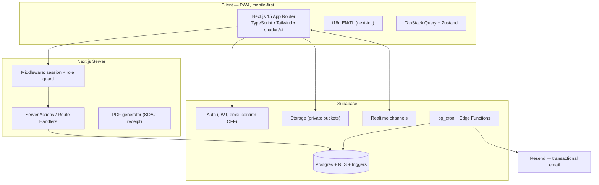

**Stack decisions**
| Layer | Choice | Bakit |
|---|---|---|
| Frontend | Next.js 15 + TypeScript | SSR, mabilis sa mahinang internet, isang codebase |
| UI | Tailwind + shadcn/ui | Mabilis buuin, accessible, mobile-first |
| Auth/DB/Storage | Supabase | Kahilingan ng user; RLS = seguridad sa DB level |
| Charts | Recharts | Consumption history |
| PDF | react-pdf / pdf-lib | SOA at resibo |
| Email | Resend | Notification (hindi para sa signup confirmation) |
| Hosting | Vercel + Supabase Cloud | Libre/mura sa simula |
| Image | Client-side compress bago i-upload (browser-image-compression) | Mahal ang data ng staff sa field |

**Route map**
```
/                     landing (public)
/login  /register  /forgot-password
/pending              waiting-for-approval screen
/dashboard            homeowner home
/dashboard/bills      /dashboard/bills/[id]
/dashboard/pay/[billId]
/dashboard/payments   /dashboard/messages   /dashboard/consumption
/dashboard/profile
/staff                worklist
/staff/readings/new   /staff/bills   /staff/payments   /staff/concerns
/admin                dashboard
/admin/payments       ⭐ confirmation queue
/admin/homeowners     /admin/staff   /admin/properties
/admin/rates          /admin/cycles  /admin/reports
/admin/announcements  /admin/audit
```

---

## 7. Non-Functional Requirements / Iba pang Kailangan

| Area | Requirement |
|---|---|
| Performance | LCP < 2.5s sa 3G; list pages paginated (25/page) |
| Mobile | Mobile-first; PWA installable; staff form usable one-handed |
| Offline | Staff reading form saves draft to localStorage, syncs kapag may signal |
| Security | RLS on every table; signed URLs (5-min TTL) for private files; rate-limit auth; no service-role key sa client |
| Privacy | Data Privacy Act (RA 10173) — consent sa registration, minimal PII, retention 5 yrs (financial) |
| Availability | 99% uptime target; Supabase daily backups (PITR sa paid plan) |
| Accessibility | WCAG 2.1 AA, ≥16px base font (marami ang senior citizen) |
| Auditability | Lahat ng financial action naka-log, immutable |
| i18n | Bawat string may EN at TL; default TL, toggle sa header |
| Browser | Chrome/Safari/Edge latest 2 versions; Android 9+, iOS 14+ |

---

## 8. Roadmap / Mga Yugto

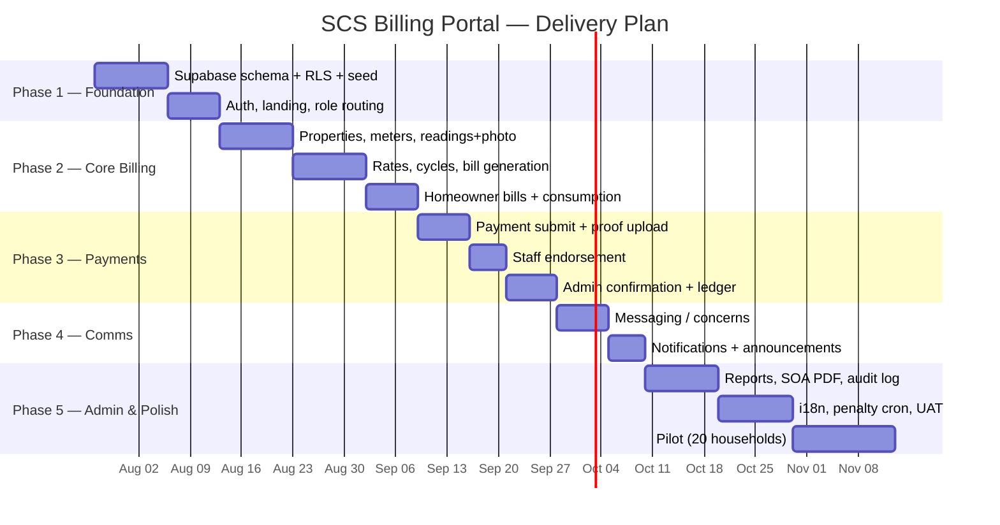

| Phase | Deliverable | Exit criteria |
|---|---|---|
| 1 | Foundation | 3 roles can log in; RLS tested with all 3 roles |
| 2 | Core billing | Isang buong cycle na-generate mula reading + photo |
| 3 | Payments ⭐ | End-to-end: submit → endorse → confirm → bill PAID |
| 4 | Communication | Concern thread resolvable; realtime notif gumagana |
| 5 | Admin & polish | Collection report tugma sa manual computation; UAT passed |

---

## 9. User Stories (Acceptance Criteria)

**US-01 — Homeowner: view bill**
> *Bilang homeowner, gusto kong makita ang detalye ng bill ko para malaman kung tama ang singil.*
- [ ] Dashboard shows current balance + due date
- [ ] Bill detail shows previous, present, consumption (m³/kWh), rate, amount, penalty, total
- [ ] Meter photo viewable and zoomable
- [ ] History of last 12 months as chart

**US-02 — Staff: encode reading with evidence**
> *Bilang staff, kailangan kong mag-upload ng litrato ng metro bilang patunay.*
- [ ] Save button disabled until photo attached
- [ ] Previous reading auto-filled, read-only
- [ ] Consumption auto-computed
- [ ] Anomaly warning requires remarks before saving
- [ ] Works on mobile, drafts survive signal loss

**US-03 — Staff: cannot touch homeowner accounts**
> *Bilang admin, ayaw kong mabago ng staff ang account ng homeowner.*
- [ ] Staff UI has no edit/delete/reset-password action on homeowners
- [ ] Direct API call by a staff JWT to update another `profiles` row returns 403 (RLS)
- [ ] Staff can still see billing info + concerns

**US-04 — Homeowner: pay via transfer**
> *Bilang homeowner, magbabayad ako sa GCash at mag-uupload ng resibo.*
- [ ] Payment channels + QR displayed
- [ ] Proof upload required; amount, ref no., date required
- [ ] Bill status becomes `payment_pending`
- [ ] Staff receives realtime notification

**US-05 — Staff: endorse payment**
> *Bilang staff, susuriin ko ang resibo bago ipasa sa admin.*
- [ ] Inbox lists submitted payments, oldest first
- [ ] Proof viewer side-by-side with bill details
- [ ] Endorse records staff id + timestamp; Reject requires reason
- [ ] Staff cannot set status directly to `confirmed`

**US-06 — Admin: confirm payment (final)**
> *Bilang admin, ako ang huling magkukumpirma ng bayad.*
- [ ] Queue shows only `endorsed` payments
- [ ] Confirm updates bill balance and generates OR number
- [ ] Partial payment leaves bill `partially_paid` with correct balance
- [ ] Action written to audit log

**US-07 — Homeowner: send concern/requirements**
> *Bilang homeowner, may padadala akong concern o dokumento sa staff/admin.*
- [ ] Category + subject + message + optional attachment
- [ ] Threaded replies with timestamps and sender role
- [ ] Status visible (open / in progress / resolved)

**US-08 — Admin: approve registration**
> *Dahil naka-off ang email confirmation, ako ang mag-a-approve ng bagong account.*
- [ ] New sign-ups land in `pending` list
- [ ] Approve links profile to a property and sets `active`
- [ ] Rejected users see a blocked screen with contact info

---

## 10. Risks & Mitigation / Panganib at Solusyon

| Risk | Impact | Mitigation |
|---|---|---|
| Email confirmation OFF → fake accounts | High | Admin approval gate + rate limiting + captcha sa register |
| Peke o luma ang screenshot ng bayad | High | Dalawang antas ng pagsusuri (staff → admin), ref no. uniqueness check, EXIF/timestamp display |
| Mahinang internet sa field | Medium | Offline drafts, image compression, retry queue |
| Maling encode ng reading | High | Anomaly detection, required photo, admin adjustment + audit |
| Staff turnover / account sharing | Medium | Individual accounts, activity log, admin deactivation |
| Senior citizens hindi marunong gumamit | Medium | Tagalog UI, malalaking font, simpleng flow, walk-in cash entry ng admin |
| Data loss | High | Supabase PITR backups, weekly export |
| Rate change mid-cycle | Medium | Effective-dated rates; bills snapshot the rate used |

---

## 11. Open Questions / Mga Kailangang Sagutin

1. **Spelling** — "Santa Cicilia" ba talaga o "Santa Cecilia"?
2. **Kuryente** — sub-metered ba ng HOA (kayo ang naniningil) o Meralco direct? Kung Meralco direct, monitoring lang ba ang portal?
3. **Rate** — magkano kada m³ (tubig) at kada kWh (kuryente)? May minimum charge ba?
4. **Association dues** — isasama ba sa parehong bill?
5. **Penalty** — ilang porsyento o fixed? Ilang araw ang grace period?
6. **Payment channels** — anong GCash number / bank account ang gagamitin? May QR ba?
7. **Ilang households** at ilang staff ang gagamit?
8. **Due date** — fixed ba (e.g., every 20th) o depende sa bill date?
9. **Cash/walk-in** — tinatanggap pa ba? (Naka-design na ako ng admin-encoded cash entry)
10. **Historical data** — may lumang record ba na ii-import (Excel)?
11. **Disconnection policy** — may automatic flagging ba kapag 2 buwang hindi nakabayad?
12. **Budget & timeline** — kailan target na live?

---

## 12. Glossary / Talasalitaan

| Term | Kahulugan |
|---|---|
| **Cubic meter (m³)** | Sukat ng nagamit na tubig — ito ang "cubic meter" na tinutukoy |
| **kWh (kilowatt-hour)** | Sukat ng nagamit na kuryente |
| **Reading** | Numerong nakita sa metro sa araw ng pagbasa |
| **Consumption** | Present reading − Previous reading |
| **Billing cycle** | Isang buwang panahon ng pagsingil (hal. 2026-08) |
| **SOA** | Statement of Account — buod ng singil at bayad |
| **Endorse** | Pagpasa ng staff sa admin ng na-verify na bayad |
| **Confirm** | Huling pag-apruba ng admin — dito lang nagiging bayad ang bayad |
| **RLS** | Row Level Security — seguridad sa mismong database |
| **OR** | Official Receipt number |

---

*End of PRD — SCS Billing Portal v1.0*
